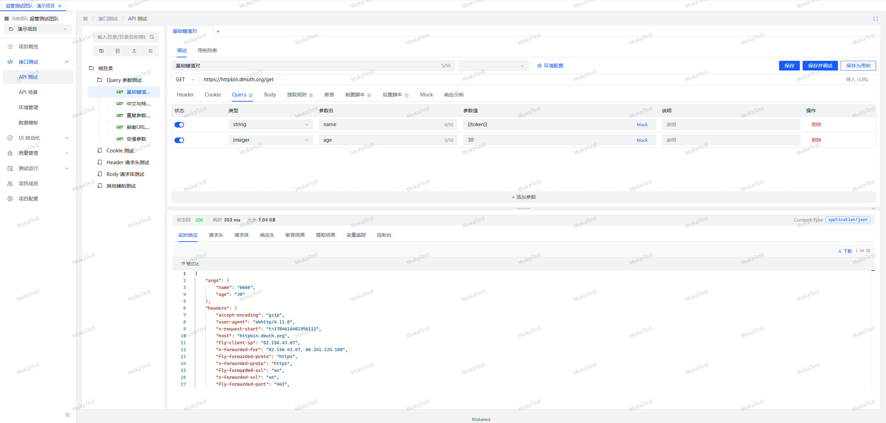
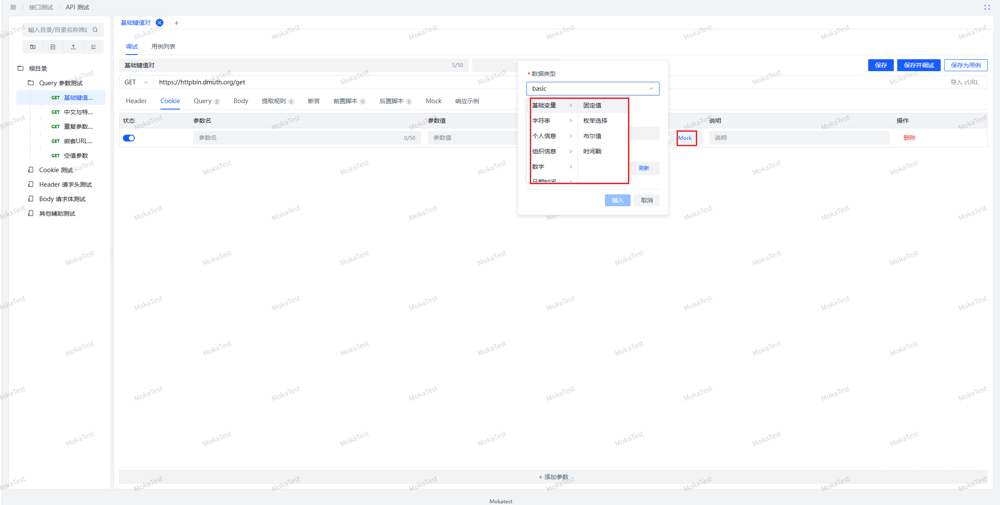
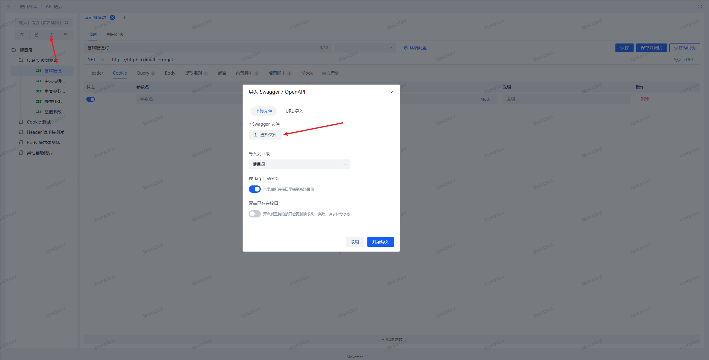

# API 测试模块使用文档

## 一、页面布局

- **左侧**：接口目录树（目录 + 接口混合），支持搜索、右键新建目录/接口、拖拽排序
- **右侧**：多标签页工作区，点击接口打开编辑 Tab，可同时打开多个接口/用例
- **顶部**：环境选择器（切换当前调试环境）、环境配置入口

## 二、接口管理

### 2.1 新建接口

1. 左侧目录树选中目标目录，点「+」（或标签栏「+」）
2. 在新 Tab 中填写：请求方法（GET/POST/PUT/DELETE/PATCH）、请求路径
3. 按需配置各 Tab 内容（见下），点「保存」

> 已有接口保存时不会改变所属目录；只有新建接口才保存到当前选中目录。

### 2.2 请求配置 Tab

| Tab | 说明 |
|-----|------|
| 鉴权 | 接口鉴权配置（见 2.3 节） |
| Header | 请求头参数表格，支持禁用单行、Mock 数据标识 |
| Cookie | Cookie 参数表格 |
| Query | Query 参数表格（自动拼到 URL） |
| Body | 请求体：none / form-data（支持文件上传）/ x-www-form-urlencoded / raw JSON / XML |
| 提取 | 关联提取规则：JSONPath / 正则 / Header / Cookie / 状态码，提取结果存入变量供后续使用 |
| 断言 | 响应断言规则，调试后展示通过/失败 |
| 前置脚本 | 请求发送前执行的 JS 脚本，可修改请求参数、设置变量 |
| 后置脚本 | 响应返回后执行的 JS 脚本，可处理响应、设置变量 |
| Mock | 接口级 Mock 配置（见第四章） |
| 响应示例 | 维护接口的响应示例文档 |

### 2.3 鉴权配置

「鉴权」Tab 集中配置接口的认证信息，发送时自动附加到请求：

| 类型 | 配置项 | 效果 |
|------|--------|------|
| 无鉴权 | - | 不附加认证信息 |
| Bearer Token | Token | 请求头 `Authorization: Bearer <token>` |
| Basic Auth | 用户名、密码 | 请求头 `Authorization: Basic base64(用户名:密码)` |
| API Key | 参数名、参数值、附加位置 | 附加到 Header（如 `X-Api-Key`）或 Query |

- 鉴权值支持 `${var}` 变量，可配合前置脚本或提取规则动态刷新 token
- 若 Header / Query 表中已手动配置同名参数，**以手动配置为准**

### 2.4 变量引用

任意参数值中可使用 `${变量名}` 或 `双大括号语法` 引用变量。变量来源优先级（同名覆盖）：

**接口参数 > 环境变量 > 全局变量**

调试结果区的「变量追踪」可看到每个变量的替换来源与命中情况。

### 2.5 参数级 Mock 数据

参数表格中可将某个参数值设置为 Mock 生成规则（如 `@phone()`、`@integer(0, 100)`、`@character('lower', 8)`、`@template(123)`）：

1. 点击参数行的 Mock 按钮打开规则弹窗
2. 选择分类（基础变量/字符串/个人信息/组织信息/数字/日期时间）与具体规则，配置参数
3. 确认后参数值显示为 `@xxx()` 标识；删除标识即恢复普通值
4. 每次发送请求时按规则生成新值

Body 原始 JSON 中也可直接手写 `@phone()` 等表达式。

> 内置规则满足不了时（如请求签名、加密），可用自定义 JS 函数，参数值输入 `@` 或 `fn.` 即可插入，详见《自定义函数使用文档》。

### 2.6 调试

- 点「发送」：以当前表单内容直接调试（不需要先保存）
- 点「保存并调试」：先保存再执行
- 结果区展示：实际请求（URL/Header/Body）、响应（状态码/Header/Body）、变量追踪、控制台日志、提取详情、断言结果
- 响应状态为 `mock` 时表示本次走了 Mock 响应，未发真实请求

### 2.7 保存为用例

调试满意后点「保存为用例」，当前配置保存为该接口下的一个用例。用例挂在接口节点下，可维护多套参数/断言组合，供 API 场景引用。

### 2.8 导入

- **Swagger 导入**：批量导入接口定义
- **cURL 导入**：粘贴 cURL 命令自动解析为接口配置

### 2.9 复制与删除

- 复制接口生成 `原名称_副本`
- 删除目录会递归删除其下所有接口与用例；删除接口会同时删除其下用例（删除为逻辑删除，确认弹窗按常规删除提示）

---

## 三、AI 生成用例

对着接口描述测试需求，AI 自动生成测试用例草稿，确认后一键写入用例列表。

**前提**：平台已配置并启用 AI 模型（AI 配置中有生效档案），且当前用户有接口新建权限。

### 3.1 入口

接口详情 →「用例列表」Tab → 右上角「AI 生成用例」，弹出对话窗口。

### 3.2 怎么用

1. 输入需求，如「针对这个登录接口生成 5 条用例，覆盖正常、密码错误、参数缺失」（条数直接写在指令里，默认 5 条）
2. AI 流式返回用例草稿表格（名称/类型/优先级/断言/Body 等），可逐条勾选
3. 点「采纳」把选中的草稿写入该接口的用例列表
4. 可继续追问追加生成（如「再补两条异常场景的」）

### 3.3 不确定点与知识库

- 需求信息不足时，AI 会在结果上方给出「不确定点」提示，点「补充说明后重新生成」完善描述即可
- 项目知识库中有相关文档时，生成结果会标注引用来源，可展开查看依据了哪些文档

> 生成历史自动保存，可回看、重新生成或删除。

---

## 四、Mock 功能使用

### 4.1 什么时候用 Mock

- 后端接口未开发完，提前编写接口定义和测试用例
- 后端不稳定/限流，希望调试与场景稳定跑通
- 模拟异常响应（500、特殊错误码）验证断言逻辑

### 4.2 配置入口

编辑接口 → 内层 Tab 切换到 **Mock**：

1. 打开「启用 Mock」开关
2. 设置响应状态码（默认 200）、响应延迟（ms）、响应 Header
3. 选择响应体模式：
   - **字段规则（RULES）**：可视化配置字段生成规则，自动生成 JSON，无需手写语法（规则类型与数据模板一致，详见《数据模板使用文档》）

### 4.3 执行行为

- 启用 Mock 后，调试/场景执行时不发真实请求，直接返回 Mock 响应
- 提取规则、断言、后置脚本对 Mock 响应同样生效，可用于完整验证链路
- 规则弹窗内支持「预览」实时查看生成效果，可手动刷新重新生成

---

## 五、SQL 接口

除 HTTP 接口外，平台支持直接调试 SQL 语句，常用于接口测试前后的数据准备与结果校验（如：调接口后查库验证数据落库）。

### 5.1 新建

API 测试页空状态（或目录树右键）选择「新建 SQL 接口」，目录树中 SQL 接口有独立图标。

> SQL 接口没有「用例列表 / 保存为用例」，只有调试。

### 5.2 数据库连接

执行前需要指定数据库连接，两种来源（优先级从高到低）：

| 来源 | 配置位置 | 说明 |
|------|---------|------|
| 步骤级覆盖 | 接口「数据库」Tab 手动填写 | 类型/IP/端口/库名/用户名/密码，支持「测试连接」 |
| 环境连接 | 环境配置的「数据库」Tab | 每个环境可配多个连接，调试时在环境旁下拉选择 |

「数据库」Tab 顶部会显示当前生效的连接；若所选连接不属于当前环境，会有黄色警告提示。

支持的数据库类型：MySQL / PostgreSQL / SQLServer / Oracle / OTHER。

### 5.3 编写与执行

- 「SQL」Tab 编写语句，**一次只能执行一条**；检测到多条会黄色警告拦截，请拆分后逐个调试
- DDL 语句（建表/改表/删表/清空）会有红色警告，执行按钮标红确认
- 点「执行」/「保存并执行」运行，结果区展示查询结果集或影响行数

### 5.4 提取与断言

SQL 结果同样可以提取变量和断言，供场景链路使用：

- **提取**：变量名 + 结果列名（列值复杂时可加 JSON 路径）+ 行下标（默认第 0 行）+ 默认值
- **断言**：列名 + 断言条件 + 期望值 + 行下标

---

## 六、常见问题

1. **服务端解析不到 JSON body**：检查是否手动设置了带 `; charset=utf-8` 的 Content-Type；平台默认裸 `application/json` 发送，自定义 Content-Type 以你配置的为准
2. **变量没替换**：在调试结果「变量追踪」中查看未命中变量；注意优先级 接口 > 环境 > 全局
3. **复制接口后保存跑到了别的目录**：已修复——已有接口保存始终保留原目录
4. **SQL 接口报「未找到数据库连接配置」**：当前环境没配数据库连接，或接口里选的连接不属于当前环境——在环境配置「数据库」Tab 补配，或改用步骤级覆盖
