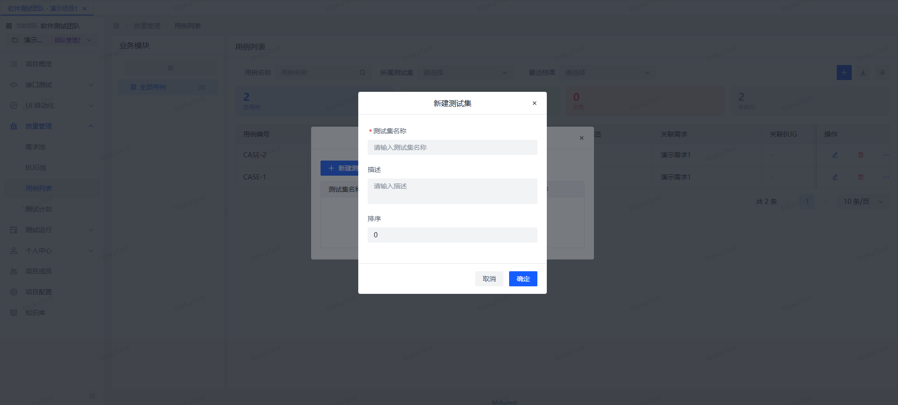
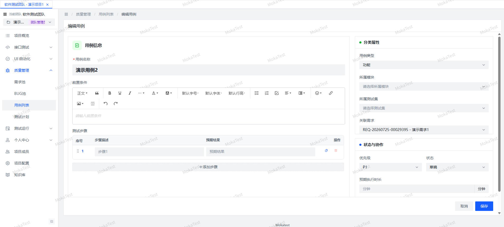

# 用例与测试集

用例是具体的测试执行单元。MokaTest 中，用例通过 **QA 模块** 和 **测试集** 两种维度组织。

## 用例组织方式

### 按模块组织

每个用例必须归属一个 QA 模块，模块树在需求/BUG/用例页面共享。

### 按测试集组织

测试集（`test_case_set`）是另一种用例分组方式，一个用例可属于多个测试集。

| 字段 | 说明 |
|------|------|
| 测试集名称 | 集合名称 |
| 描述 | 测试集说明 |
| 排序 | 同级排序 |

### 新建/编辑用例

