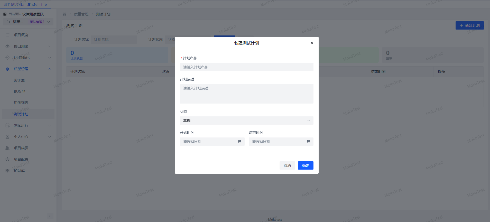
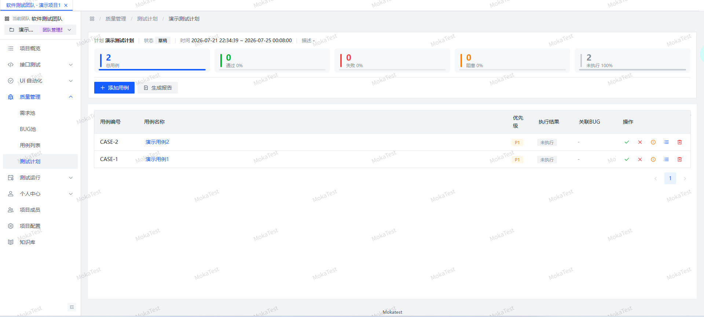
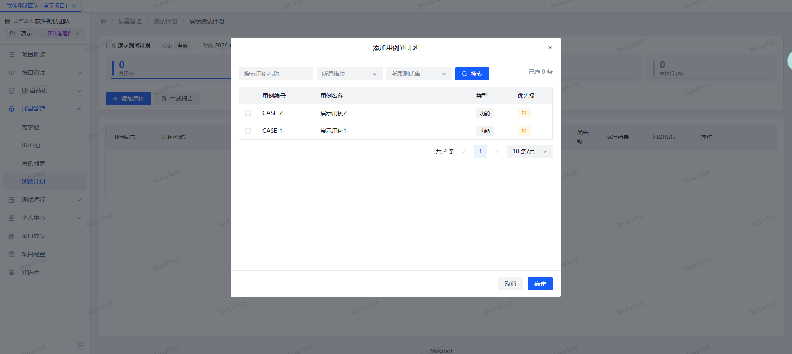

# 测试计划

QA 测试计划用于组合一批文字用例，手动或批量执行，并记录执行结果。

## 测试计划字段

| 字段 | 说明 |
|------|------|
| 计划名称 | 测试计划名称 |
| 描述 | 计划说明 |
| 状态 | 计划状态 |
| 开始时间 | 计划开始时间 |
| 结束时间 | 计划结束时间 |

## 计划用例

测试计划创建后，可从当前项目的用例中添加用例到计划：

- 支持按用例、模块、测试集批量添加。
- 每个计划用例包含执行结果、执行备注、执行人、执行时间、关联 BUG。

## 执行用例

在测试计划详情页，可对单个或多个用例执行：

- 选择执行结果：PASS / FAIL / BLOCK / NA
- 填写执行备注
- 若执行失败，可直接创建 BUG

## 执行历史

每个用例的执行历史会被记录到 `test_case_execution` 表，方便回溯。

## 报告

测试计划执行完成后，可生成报告查看通过/失败/阻塞/未执行统计。