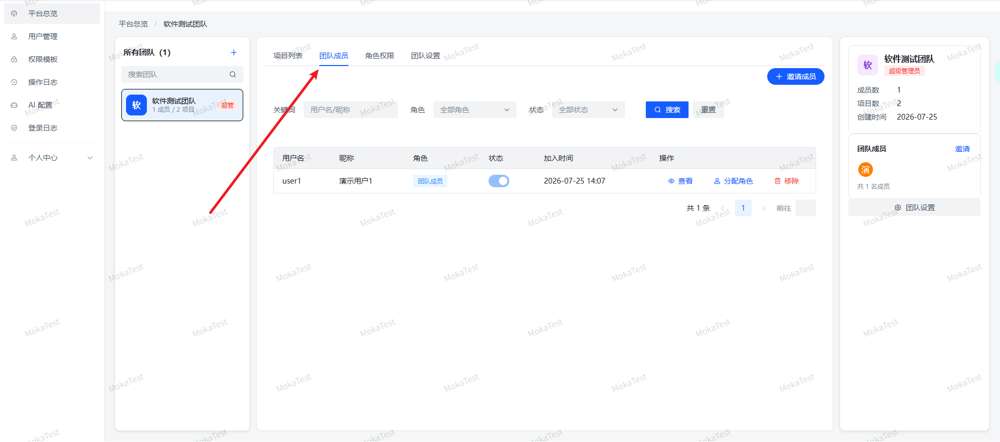
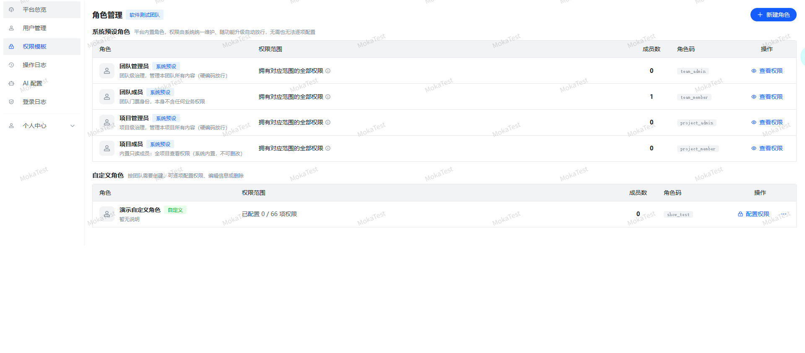

# 成员与角色

MokaTest 支持两级成员管理：团队级成员和项目级成员。

## 团队级成员

- 添加成员：从平台用户中选取，分配团队角色。
- 修改角色：可重新分配该成员在团队中的角色（团队成员、团队管理员）。
- 移除成员：将该成员从团队中移除，同时会将成员移出团队下的所有项目。

## 项目级成员

- 项目成员必须从**当前团队的成员**中选取。
- 可为项目成员单独分配项目级角色，实现更细粒度的权限控制。

## 角色来源

角色分为两类：

- **系统内置角色**：超管、团队管理员、团队成员、项目管理员、项目成员 不可删除。
> 1. 超管：拥有所有团队，所有项目的操作权限（个人团队除外）
> 2. 团队管理员：拥有管理团队下所有项目的操作权限
> 3. 团队成员：团队里非团队管理员的角色
> 4. 项目管理员：拥有项目的所有权限，可以给项目成员分配项目角色
> 5. 项目成员：拥有项目的可读权限
- **自定义角色模板**：只有超管可以创建权限模板，所有项目成员都有被分配

