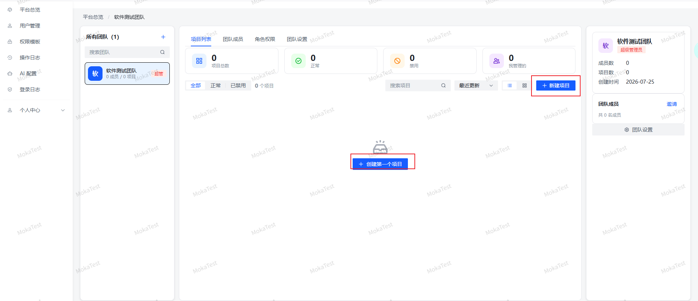
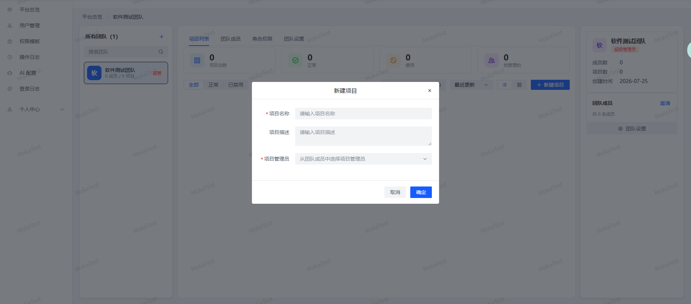
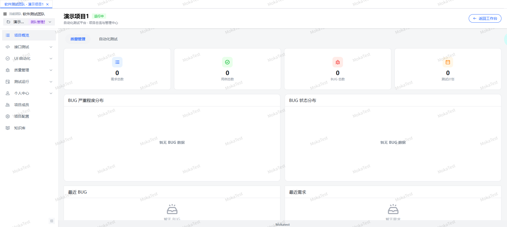
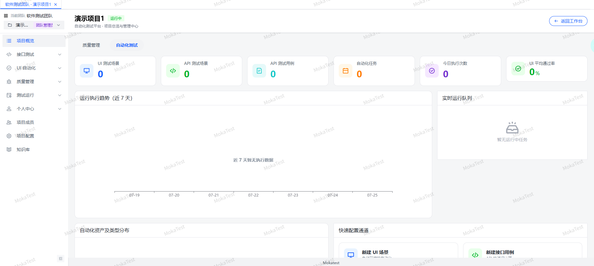
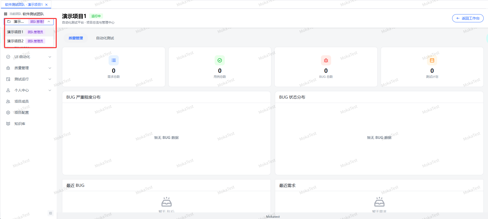
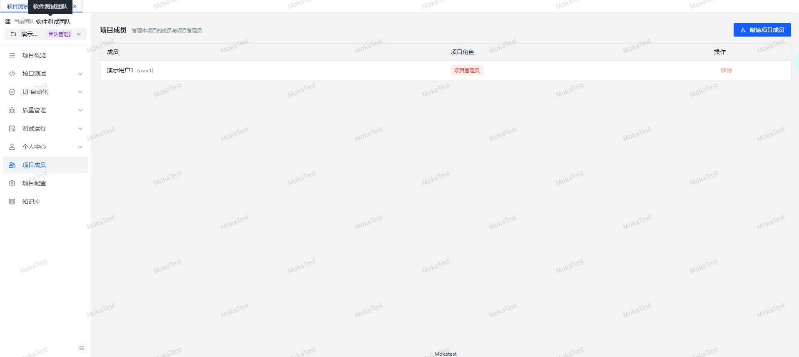
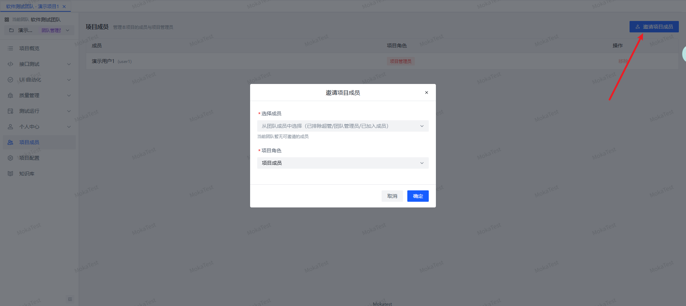

# 项目管理

项目是团队下的数据容器，所有测试相关数据都归属于项目。

## 创建项目

进入团队工作台后，点击「新建项目」创建项目。项目需要填写名称、描述，并关联到当前团队。

## 项目概览

进入项目后，项目概览页展示两类统计信息：

- **质量管理**：需求、BUG、用例等统计卡片。
- **自动化测试**：UI/API 场景数、任务计划、报告等统计。

## 切换项目

在顶部导航栏的项目下拉框切换当前项目。切换项目时会重新加载当前用户在该项目下的权限。

## 项目成员

除了团队级成员，每个项目还有独立的成员列表。项目成员从团队成员中选取，可分配项目级角色。

