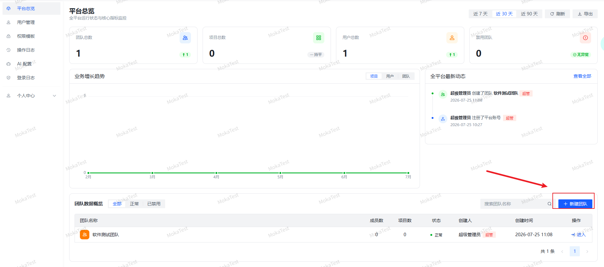
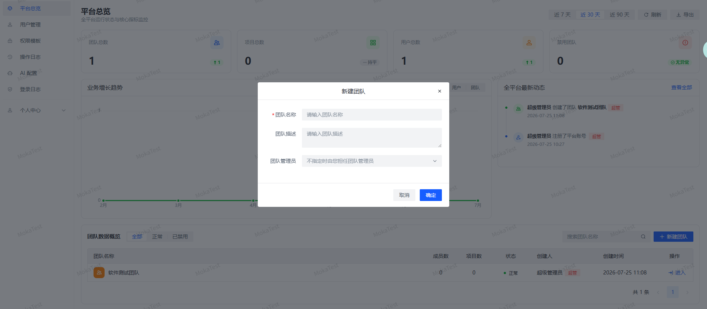
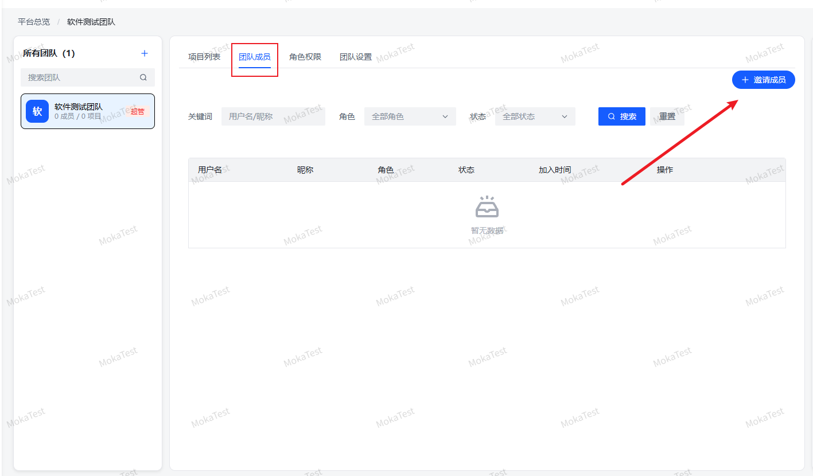
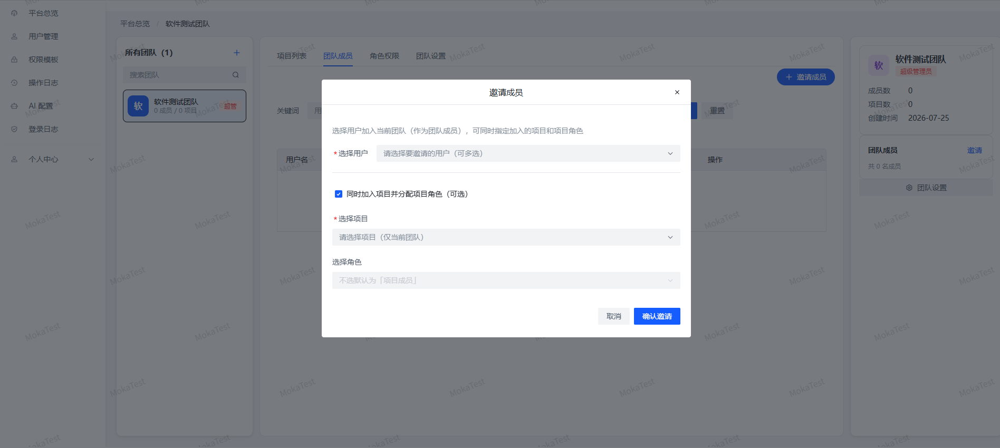
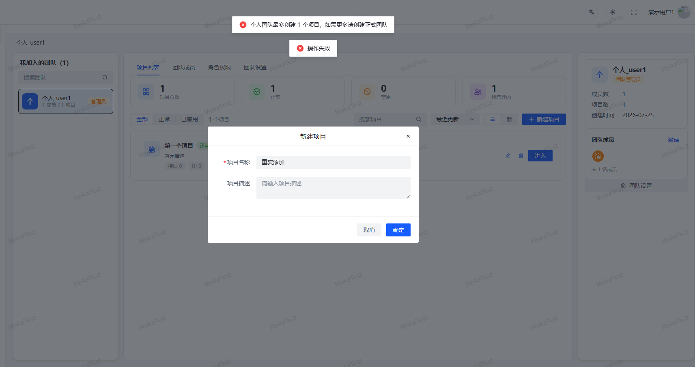

# 团队管理

团队是 MokaTest 的顶层组织单位。

## 创建团队

在平台概览页，团队列表点击「新建团队」，填写团队名称、描述即可创建、团队管理员可选填。

> 只有超管才可以创建团队

## 团队成员

每个团队有独立的成员列表，成员可以被分配不同角色。

- 支持邀请已有用户加入团队。
- 支持修改成员角色、状态、移除成员。
- 团队所有者或超管通常拥有团队管理权限、支持邀请团队成员的时候同时指定加入项目、项目角色（可选）。

## 个人团队

每个用户默认拥有一个个人团队（`is_personal = true`），用于个人试用和私有项目。
个人团队只允许创建一个项目，且个人团队不允许邀请成员

