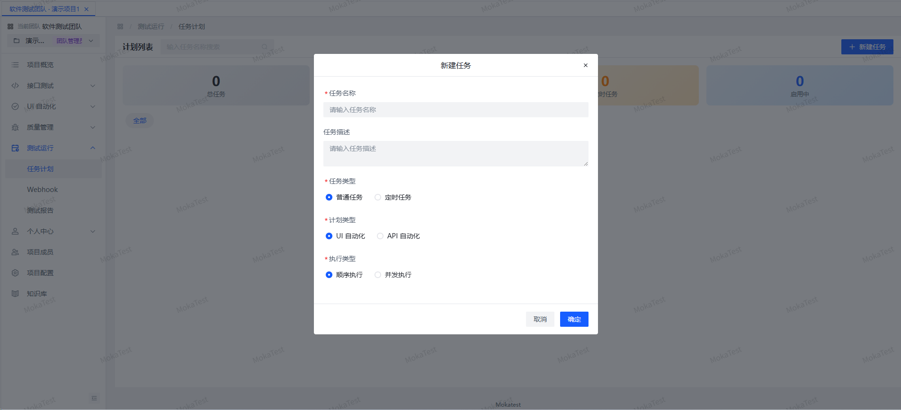
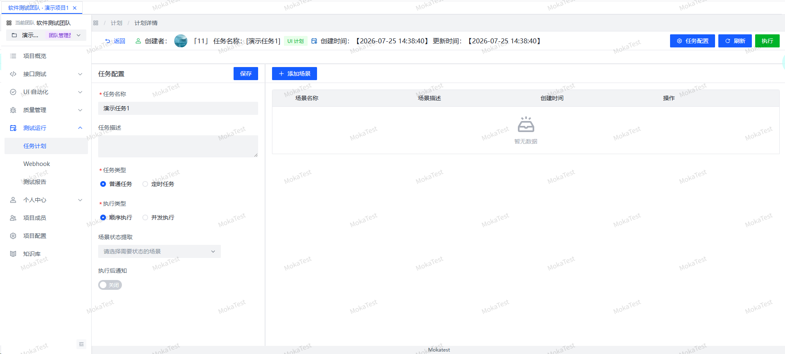
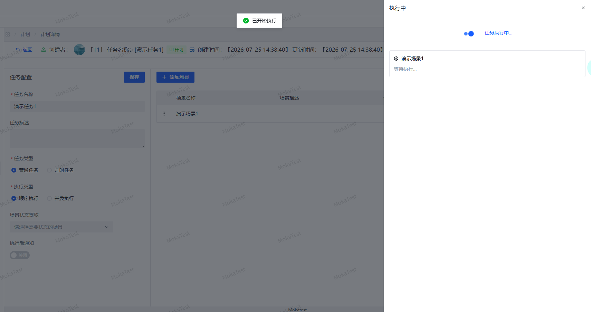
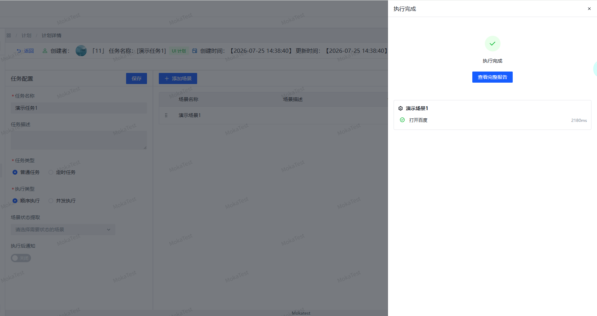

# 任务计划

自动化任务计划用于组合 UI/API 场景，支持定时触发和手动执行。

## 任务计划字段

| 字段 | 说明 |
|------|------|
| 计划名称 | 任务名称 |
| 计划类型 | UI / API / MIXED |
| 执行类型 | 普通任务 / 定时任务 |
| Cron 表达式 | 定时任务使用 |
| 描述 | 计划说明 |
| 运行配置 | 浏览器类型、窗口模式等 |
| 参数 | 执行参数（JSON） |
| Webhook | 执行完成通知 |

## 新建任务计划

1. 点击「新建任务」按钮。
2. 选择任务类型（UI/API）和执行方式（普通/定时）。
3. 从场景树中选择要执行的场景。
4. 配置运行参数和 Webhook 通知。
5. 保存计划。

## 选择场景

任务计划中的场景来自 UI 场景或 API 场景目录树，支持：

- 单个场景选择
- 整个目录批量选择
- 调整场景执行顺序

## 执行任务

- **手动执行**：点击任务卡片上的「执行」按钮。
- **定时执行**：设置 Cron 表达式后，系统按计划自动触发。
- **重跑**：对历史任务可重新执行。

执行前若任务正在运行，会先停止当前任务。

## 删除计划

删除计划前，若任务正在运行，系统会先停止任务，再执行逻辑删除。

