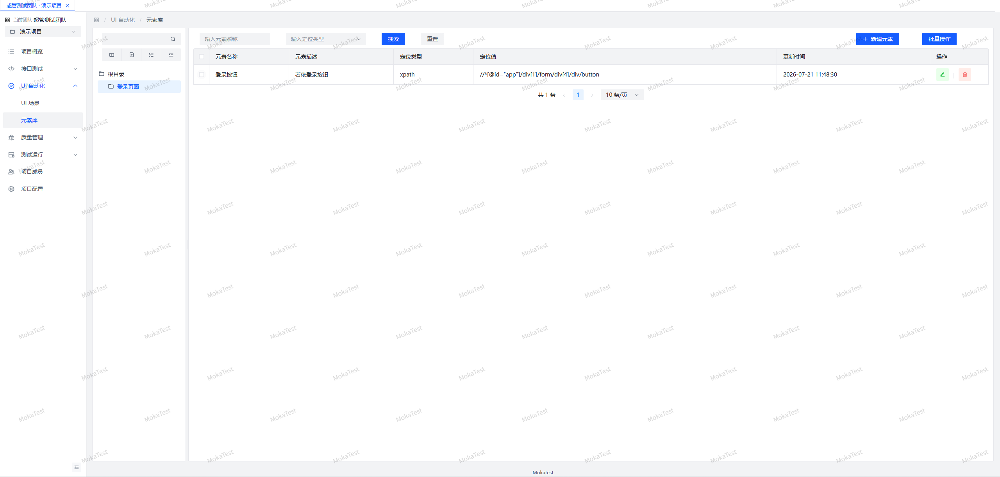
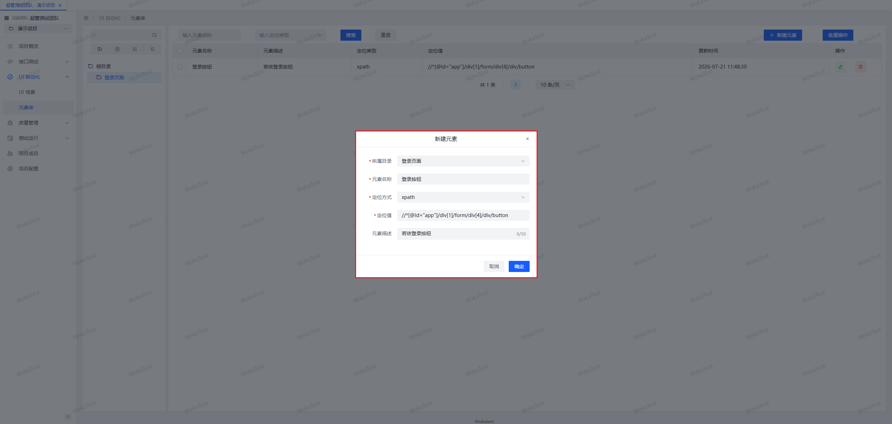
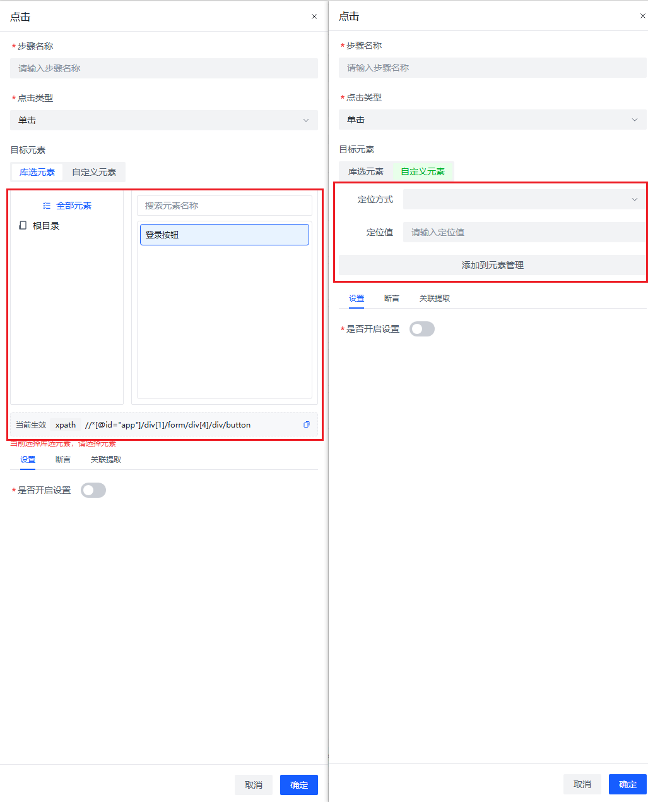

# 元素库使用文档

> 面向使用者的操作指南。菜单位置：**UI 自动化 → 元素库**。
> 元素库集中管理页面元素定位，UI 场景步骤通过「库选元素」引用。**改一次元素库，所有引用该元素的场景自动生效**——这是元素库最大的价值。

---

## 一、页面布局

- **左侧**：目录树（顶部为虚拟「根目录」），右键可新建子目录/新建元素/编辑/删除，支持拖拽排序
- **右侧**：选中目录下的元素列表，支持批量选择与批量删除
- **顶部**：新建目录、新建元素、显示全部、展开/折叠

---

## 二、元素管理

### 2.1 新建元素

1. 选中目标目录，点「新建元素」
2. 填写：元素名称、定位方式、定位值、描述

### 2.2 定位方式（9 种）

| 定位方式 | 说明 | 示例 | 推荐度 |
|----------|------|------|--------|
| TEST_ID | 测试 ID 属性（data-testid） | `login-btn` | ⭐⭐⭐ 最稳定 |
| ROLE | ARIA 角色 + 名称，格式 `角色::名称` | `button::登录` | ⭐⭐⭐ |
| LABEL | 关联 label 文本 | `用户名` | ⭐⭐ |
| PLACEHOLDER | 输入框占位文本 | `请输入手机号` | ⭐⭐ |
| TITLE | title 属性 | `关闭` | ⭐⭐ |
| ALT | 图片 alt 文本 | `logo` | ⭐⭐ |
| TEXT | 可见文本 | `提交订单` | ⭐⭐ |
| CSS | CSS 选择器 | `#app .submit-btn` | ⭐ |
| XPATH | XPath 表达式 | `//div[2]/button` | ⭐ 最脆弱 |

> 建议优先与前端约定 `data-testid`，其次用 ROLE；XPATH 只在无其他选择时使用。

### 2.3 编辑 / 删除

- 编辑元素后，**所有引用它的 UI 场景下次执行时自动使用新定位**，无需逐个改场景
- 删除目录会递归删除其下所有子目录和元素（逻辑删除）
- 删除元素后，引用它的场景步骤**不会立刻失败**：步骤内保留了删除时的定位快照，执行时自动用快照兜底；下次打开该步骤编辑时会提示「原元素库中的元素已被删除，已转为自定义定位」

---

## 三、在场景步骤中使用元素

元素类步骤（点击/悬停/输入/断言等）的目标元素支持两种来源，单选切换，**两边数据都保留，选哪个以哪个为准**：

### 3.1 库选元素（推荐）

- 左侧目录树 + 右侧元素列表，可按名称搜索，点击选中
- 优势：统一定位维护、库改全量生效、团队成员复用
- 底部「当前生效」条显示实际生效的定位，可复制

### 3.2 自定义元素

- 直接在步骤里写定位方式 + 定位值，不入库
- 适合一次性、无复用价值的定位
- 点「**添加到元素管理**」可把当前自定义定位一键沉淀进元素库，保存后自动切回库选并选中新元素

### 3.3 典型工作流

1. 录制/手工编排场景时先用自定义定位快速跑通
2. 跑通后逐个「添加到元素管理」沉淀
3. 页面改版导致定位失效时，只改元素库一处，全部场景恢复

---

## 四、常见问题

1. **改了元素库，场景没生效**：场景执行时才实时取库中最新值——确认是「执行时」没生效而不是编辑器里显示旧值；编辑器打开旧步骤会显示快照，保存后刷新
2. **提示「元素定位信息缺失」**：该步骤库选和自定义两侧都为空，检查是否误清了定位
3. **ROLE 定位不生效**：注意格式必须是 `角色::名称`（两个英文冒号），名称是元素的可访问名称（通常是可见文本），且为精确匹配
4. **录制导入的定位在哪里**：录制产生的定位默认存为步骤的「自定义定位」，需要复用的手动「添加到元素管理」
